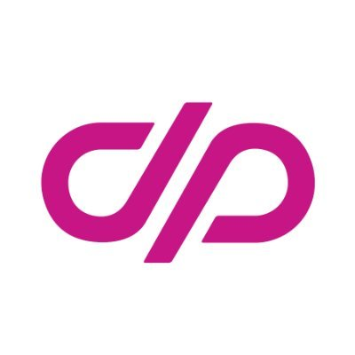

<h1 align="center">Hello 👋, I'm Keaton</h1>
<h3 align="center">A trans girl dev that does goofy things online!</h3>

<h3>

Pronouns.page
</h3>

<h4>Names</h4>

<strong>💜 Keaton</strong>

👍 Kat

<h4>Pronouns</h4>

<strong>💜 she/her</strong>

👍 they/them

<small>👎 he/him</small>

<h4>Words</h4>

Expand

  <table>
    <tr>
      <th>Honorifics</th>
      <th>Person and family descriptions</th>
      <th>Relationship descriptions</th>
      <th>Compliments</th>
    </tr>
    <tr>
      <th><strong>💜 ms.</strong></th>
      <th><strong>💜 woman</strong></th>
      <th>👍 friend</th>
      <th>👍 pretty</th>
    </tr>
    <tr>
      <th><strong>💜 ma'am</strong></th>
      <th><strong>💜 lady</strong></th>
      <th>📔 wife</th>
      <th>👍 cute</th>
    </tr>
    <tr>
      <th><strong>💜 madam</strong></th>
      <th><strong>💜 girl</strong></th>
      <th>📔 girlfriend</th>
      <th>📔 hot</th>
    </tr>
    <tr>
      <th></th>
      <th>😋 buddy</th>
      <th>📔 lover</th>
      <th>📔 sexy</th>
    </tr>
    <tr>
      <th></th>
      <th>😋 pal</th>
      <th>👎 husband</th>
      <th>👎 handsome</th>
    </tr>
    <tr>
      <th></th>
      <th>😋 comrade</th>
      <th>👎 boyfriend</th>
      <th></th>
    </tr>
    <tr>
      <th></th>
      <th>🔒 bro</th>
      <th></th>
      <th></th>
    </tr>
  </table>

<h4>Emoi meaning</h4>

Expand

  <table>
    <tr>
      <th>💜 Yes<th>
      <th>😋 Jokingly</th>
      <th>🔒 Only if we're close</th>
      <th>👍 Okay</th>
      <th>👎 Nope</th>
      <th>📔 Partner</th>
    </tr>
  </table>

- 🔭 I’m currently working on [The Goofball Theater](https://goofballtheater.github.io/goofball/)

- 🤝 I’m looking for help with [Statusfi](https://keatonbuilder.github.io/statusfi)

- 👨‍💻 All of my projects are available at [https://keatonbuilder.github.io/keatonbuilder/](https://keatonbuilder.github.io/keatonbuilder/)

- 📫 How to reach me **[Discord](https://discord.gg/zjFBKdJKvt)**

- ⚡ Fun fact **I can be quite silly at times..**

<h3 align="left">Connect with me:</h3>

<h3 align="left">Languages and Tools:</h3>

     

